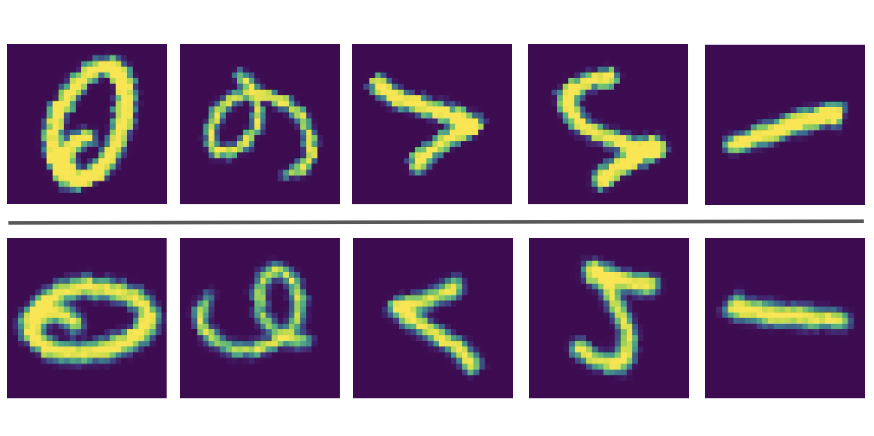

# Orbit-symmetrize
**Learning Symmetrization for Equivariance with Orbit Distance Minimization**
[Tien Dat Nguyen*](https://github.com/tiendatnguyen-vision), [Jinwoo Kim*](https://jw9730.notion.site/Jinwoo-Kim-0560795427964cafa7481dc448baa4aa), [Hongseok Yang](https://sites.google.com/view/hongseokyang/home), [Seunghoon Hong](https://maga33.github.io/) <br>
NeurIPS 2023 Workshop on Symmetry and Geometry in Neural Representations <br>

[](https://arxiv.org/abs/2311.07143)



## Running experiments
The implementation for our methods and baselines in the **Rotated MniST** experiment (table 1(a)) can be found in the directory **RotatedMNIST**.
Implementation for the **Particle Scattering** experiment (table 1(b)) can be found in the directory **ParticleScatter**. Please refer to these directories for more detailed guidelines for environment setup and how to run those experiments. 

## References
Our implementation uses code from the following repositories:
- [emlp-pytorch](https://github.com/jw9730/emlp-pytorch.git)
- [lps](https://github.com/jw9730/lps.git)
- [kornia](https://github.com/kornia/kornia.git)

## Citation
If you find our work useful, please consider citing it:
```bash
@article{nguyen2023learning,
author = {Tien Dat Nguyen and Jinwoo Kim and Hongseok Yang and Seunghoon Hong},
title = {Learning Symmetrization for Equivariance with Orbit Distance Minimization},
journal = {NeurIPS Workshop on Symmetry and Geometry in Neural Representations},
year = {2023}
}
```
